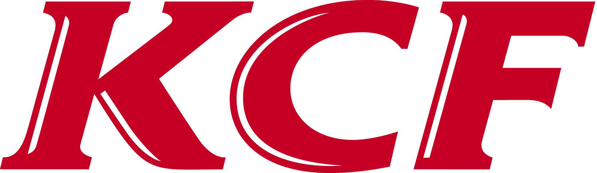

# Kubernetes Cloud Foundry (KCF)

We think that Cloud Foundry is great, and Kubernetes a different kind of awesome.

We believe that combining the two makes deploying code and stateful services the best experience anyone could wish for.

You can experience this dream with a single command: `make kcf`
